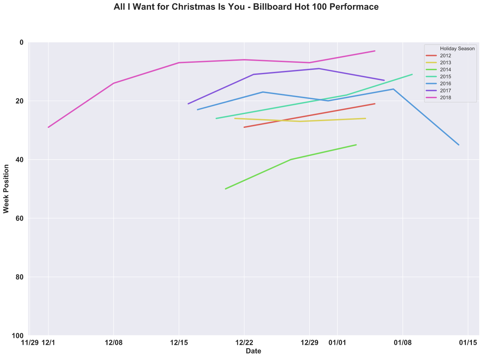
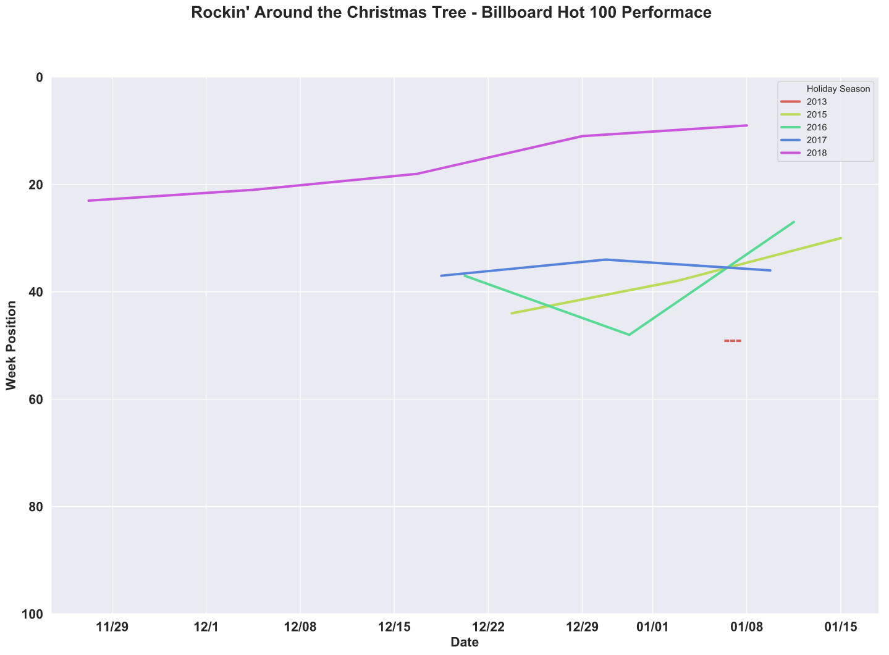
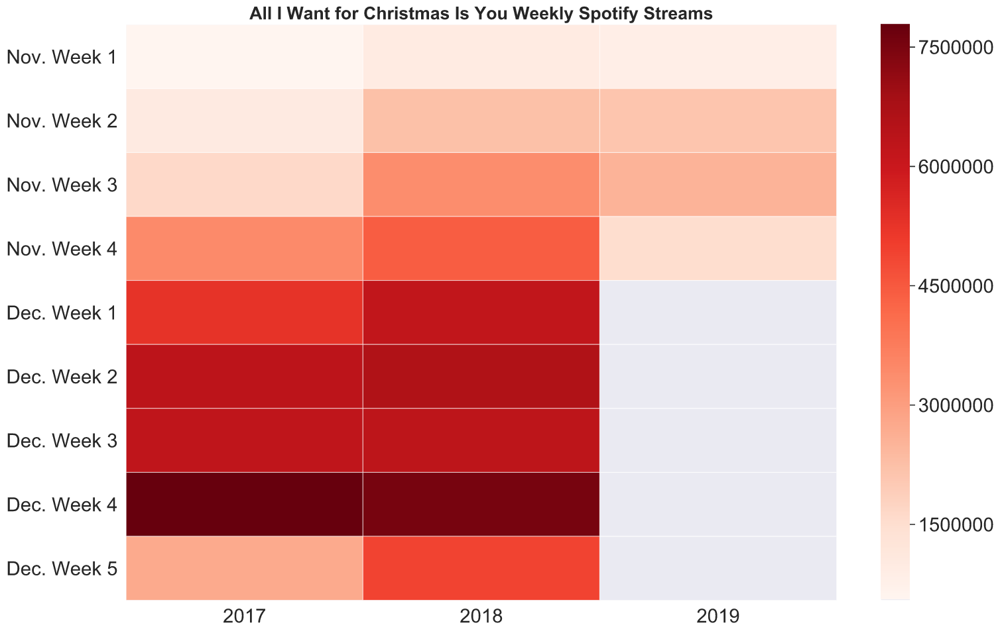
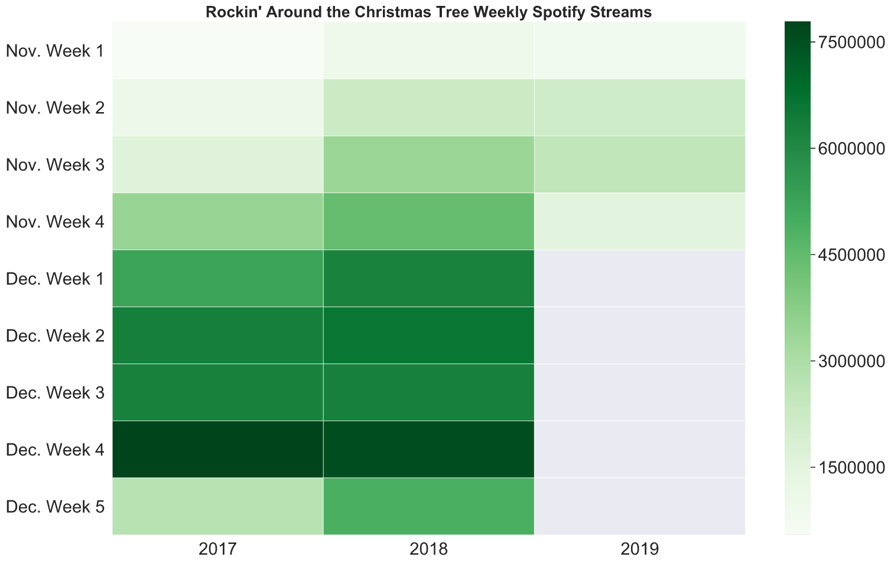
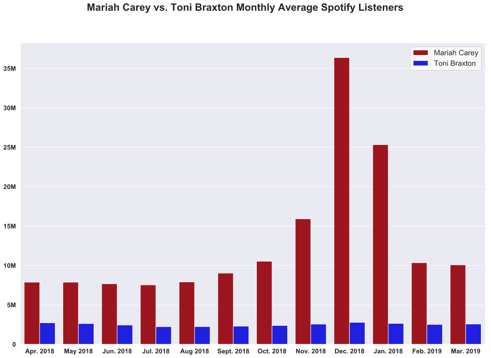
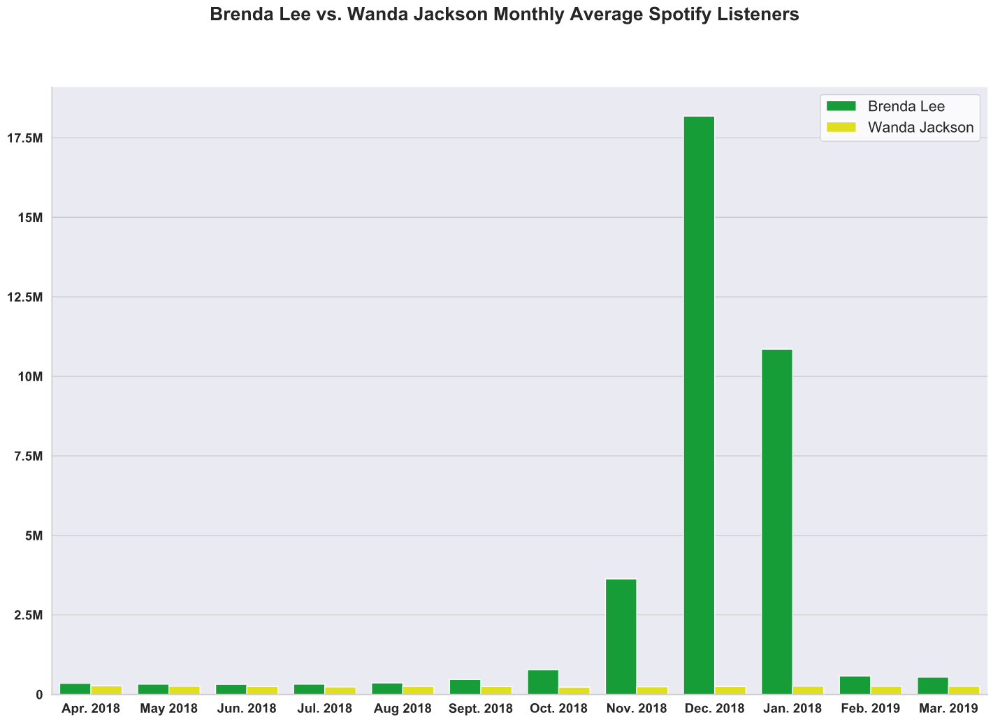

#  The Crown Christmas Carols
## Mariah Carey, Brenda Lee, and the two Christmas songs that will never die

The holiday season has an almost mythical ability to evoke a wide range of emotions from people. For so many, the end of the year is brimming with joy, excitement, and gratitude. For others, it can be weeks filled with pain, cynicism, or misanthropy. Regardless of one's personal attitudes towards the holidays, the main reason that a simple point of time in the calendar can spur such intense feelings lies in the power of tradition. 

While individual people doubtlessly have their own unique traditions during the holiday season, the holiday traditions of broader American society revolve around a handful of activities. Chief among these are [attending religious services](https://www.pewresearch.org/fact-tank/2014/04/18/when-easter-and-christmas-near-more-americans-search-online-for-church/), [connecting with family](https://www.travelweekly.com/Travel-News/Travel-Agent-Issues/40-percent-of-Americans-expected-to-travel-during-holidays), [eating bountiful meals](https://www.ajc.com/lifestyles/food--cooking/eat-million-turkeys-this-thanksgiving-plus-more-holiday-factoids/8GbHMKEHBaBfQvCl67FVWO/), [giving various gifts](https://abcnews.go.com/WN/mailform?id=14998335), [getting dangerously inebriated](https://www.abc15.com/news/national/drunk-driving-statistics-new-years-eve), watching timeless [movies](https://www.today.com/popculture/75-best-christmas-movies-all-time-2019-holidays-ranked-t168135) and [plays](https://www.backstage.com/magazine/article/classic-contemporary-holiday-plays-musicals-11396/), and of course, [Christmas music] (https://pitchfork.com/features/lists-and-guides/9977-the-50-best-holiday-songs-of-all-time/). 

And out of all the traditional classics, contemporary covers, and ingenious originals in the holiday discography, there are two tunes that truly stand out: Mariah Carey's "All I Want for Christmas Is You" and Brenda Lee's "Rockin' Around the Christmas Tree". If the influence of a holiday song can be derived from how rooted it is in tradition, no song can parallel Mariah and Brenda's Christmas epics. They are the only two songs that have appeared in **eight** separate instances on Billboard's weekly Hot 100 song chart. It's worth taking a dive into some numbers behind these songs to illustrate just how magical they genuinely are.

First, Carey's "All I Want for Christmas is You" off her *Merry Christmas* album was released on October 29th, 1994 to [critical acclaim](https://pqasb.pqarchiver.com/boston/access/62040881.html?dids=62040881:62040881&FMT=ABS&FMTS=ABS:FT&type=current&date=Dec+04%2C+1994&author=Steve+Morse%2C+Globe+Staff&pub=Boston+Globe+%28pre-1997+Fulltext%29&desc=Carey+marks+the+season+with+music%2C+good+works&pqatl=google). At the time, Carey was still very much in her prime and had just come off the success of her third album *Music Box*, which debuted at number-two on the Billboard 200 album chart and had nearly half of its songs crack the top 10 on the [Billboard Hot 100](https://www.billboard.com/articles/review/5679999/mariah-careys-music-box-at-20-classic-track-by-track-review). However, aside from the week ending on January 8th, 2000, her lead single off of *Merry Christmas* did not make the Billboard Hot 100 song chart until the week ending on December 22nd, 2012. Since then, the song has charted every single year.

What is fascinating about the Billboard Hot 100 performance of "All I Want for Christmas Is You" is the truncated curve of the song's weekly journey. Instead of taking the life cycle of a normal chart-climber that rockets up to the top 10 as it gains popularity and then gradually fizzles out as said interest wains, Carey's Christmas classic gains steam quickly as the holiday season races by and then just after New Year's Day disappears entirely from the list, never to be seen again for 10 months. Interest in the song could not be more seasonal.

Unlike Mariah Carey, Brenda Lee penned "Rockin' Around the Christmas Tree" in 1958 when her career as a singer was starting at [the age of 13](https://www.thevintagenews.com/2016/12/11/brenda-lee-was-only-13-years-old-when-she-recorded-rockin-around-the-christmas-tree/)! The Atlanta native would go on to have immense success as a pop artist throughout the 1960s yet the initial release and re-release of "Rockin' Around the Christmas Tree" was a [flop](https://www.billboard.com/articles/news/holiday/8488659/brenda-lee-rockin-around-the-christmas-tree-lyrics) until Lee's popularity catapulted it into the Billboard Hot 100 in 1960. The song charted the next two Christmases but eventually fell out of popularity as a holiday hit until it re-charted 62 years later on the week ending on January 4th, 2014. The tune has rocked its way to the top of the charts every December since then only to fall off a cliff right after January 1st.

The common denominator behind the renewed success of these two holiday songs is glaringly obvious. It is no coincidence that these two songs have re-entered the American musical pop charts just as smartphones and music streaming services such as Spotify have quickly begun to be the dominant way that the world consumes music. Holiday music, in particular, seems perfectly positioned to fit into the streaming services' music rental model. If you only want to listen to the specific songs for a six-ish week period per year, it becomes infinitely more accessible to stream them on say a Bluetooth speaker at your holiday party rather than buying the physical CDs and playing them on a stereo as one would have had to do mere 20 years earlier. 

In fact, since 2017 -- the earliest Spotify Charts has posted top streaming data on its site -- during the months of November and December both "All I Want for Christmas Is You" and "Rockin' Around the Christmas Tree" have had streaming numbers comparable to that year's top tracks. 

Interestingly, since 2017 "All I Want for Christmas" has entered the Spotify Top 200 chart on November 1st exactly, a trend Mariah has [seemingly picked up on herself](https://twitter.com/MariahCarey/status/1190161809887694848?s=20). "Rockin' Around the Christmas Tree" has popped up in the Spotify Top 200 later in that first week of November. Streaming numbers from both of the songs for the holiday season seem to mirror the Billboard Chart performance the two songs have been enjoying most of the entire decade. A quick rise in chart and streaming popularity through November and December, a Christmas crescendo, and a post-New Year's dissipation. 

To underscore how truly extraordinary the success of these two songs are, it is helpful to look at what they have done for Mariah Carey and Brenda Lee's careers today. Both Carey and Lee's averaged Spotify "Monthly Listeners" as compared to a contemporary that has not released popular Christmas music, Toni Braxton and Wanda Jackson, respectively, is very illustrative of just how dependent both Carey and Lee's total streaming numbers are on their holiday hit's success.

Without a doubt, both "All I Want for Christmas is You" and "Rockin' Around the Christmas Tree" will hit the Billboard Hot 100 again this year, and every year for the foreseeable future as the two songs have been stapled to the forefront of every American holiday playlist. Carey's "All I Want for Christmas Is You" is already the [12th best selling single of all time](http://www.seattlepi.com/technology/businessinsider/article/The-True-Story-Behind-Mariah-Carey-s-All-I-Want-5092879.php) and has reportedly netted Carey [over 60 million dollars in royalties](https://www.webcitation.org/6vOMs43oI?url=https://www.economist.com/blogs/graphicdetail/2017/11/daily-chart-25?fsrc=scn%2Ftw%2Fte%2Fbl%2Fed%2F) along with [book](https://www.webcitation.org/6vAsSEAT7?url=https://www.hollywoodreporter.com/news/mariah-careys-all-i-want-christmas-is-you-song-become-universal-movie-987595) and [film](http://www.nydailynews.com/gossip/2008/09/22/2008-09-22_mariah_carey_makes_new_push_into_acting.html) adaptations. At the time of the 50th anniversary of its release, Lee's "Rockin' Around the Christmas Tree" was the [4th most downloaded Christmas song ever](https://countrymusicnation.com/leann-rimes-shimmies-around-the-stage-while-singing-rockin-around-the-christmas-tree). With no end in sight, these two songs will continue to both capture the popular holiday imagination of the American public, and carry the careers of the artists who sing them long after their peaks.

Code behind this analysis can be found [here](https://github.com/anesta95/Holiday_Song_Analysis)!