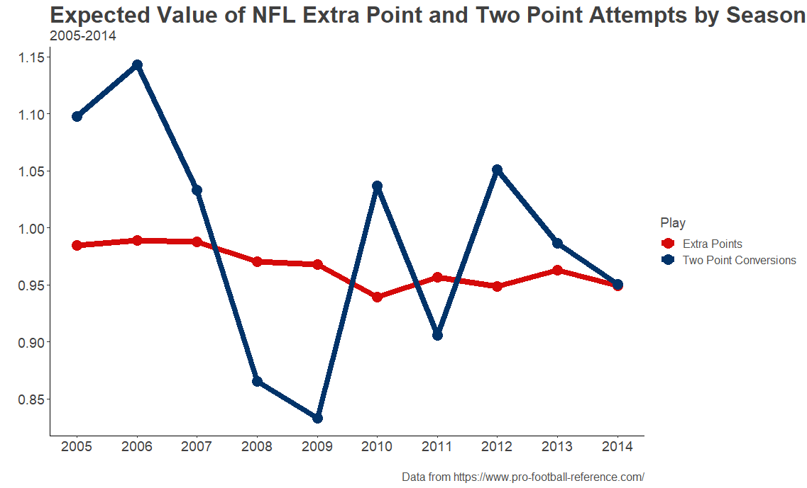
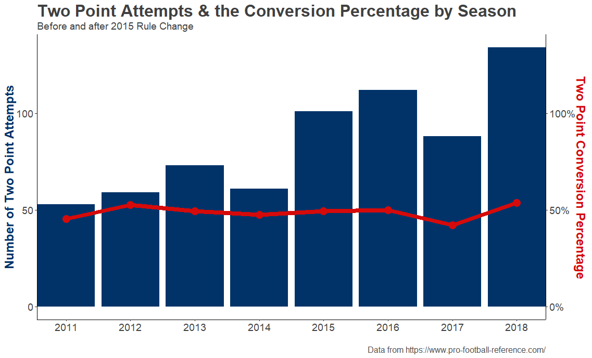
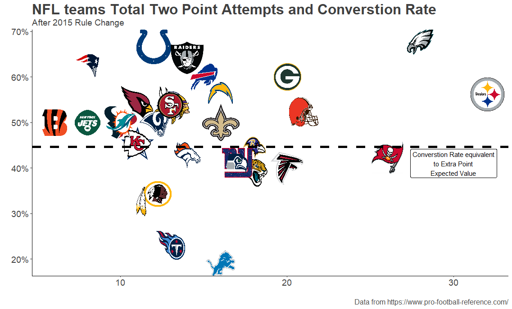
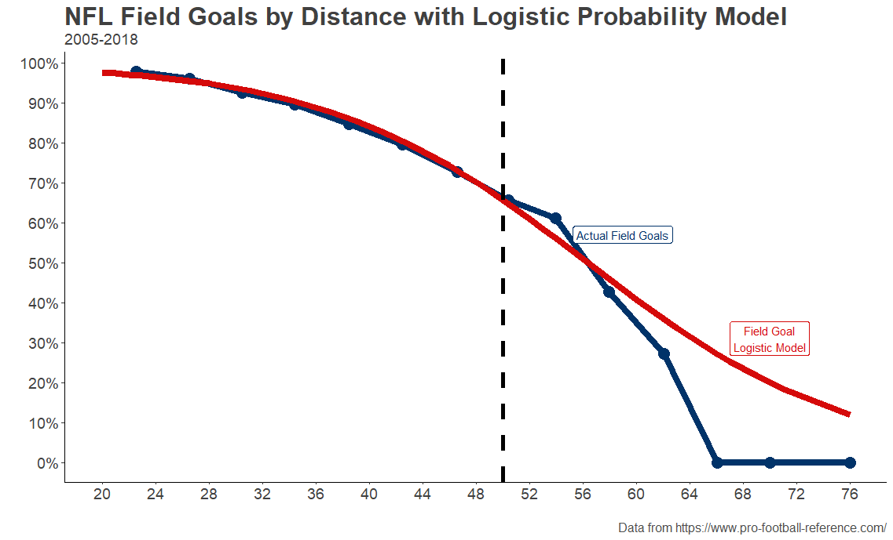
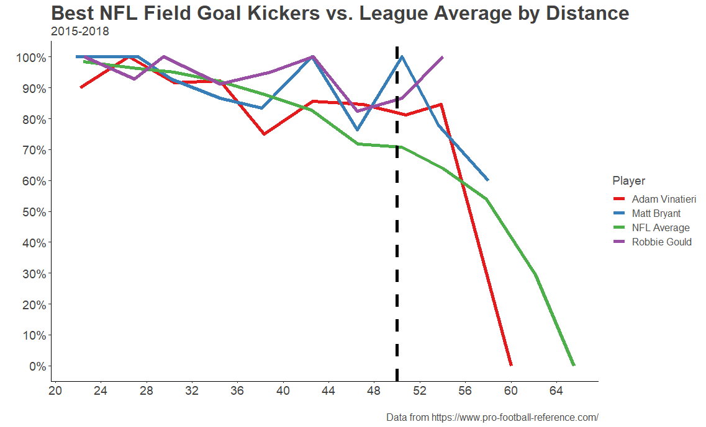

# Just Go for Two
## The Extra Point Attempt vs. the Two Point Attempt

Every Sunday for 21 weeks a year, millions of people across the globe tune in to watch the slate of NFL games being played across the United States (and occasionally London and Mexico City). The NFL is [$13+ billion dollar](https://www.marketwatch.com/story/the-nfl-made-13-billion-last-season-see-how-it-stacks-up-against-other-leagues-2016-07-01) industry that Rodger Goodell -- the league's current commissioner -- has placed a goal to make $25 billion by 2027. Despite [widespread complaints about officiating](https://www.espn.com/nfl/story/_/id/27868273/nfl-officiating-getting-better-league-blame), President Trump's attempts to lasso the NFL into his broader culture war messaging over [national anthem protests by players](https://www.cbssports.com/nfl/news/donald-trump-proposes-national-anthem-policy-for-nfl-that-involves-two-punishments/), and of course [the ongoing CTE/head trauma crisis](https://www.si.com/nfl/2017/07/25/boston-university-study-cte-nfl-player-brains), the league is still making money hand over fist.

By far, the most important feature of this profitable product the league puts out every week is the touchdown. By either running or passing the ball into the endzone on either side of the field, the six-point play is the most valuable in the game and is usually very exciting, if not scintillating. Take for example when Cincinnati Bengals Wide Receiver Jerome Simpson [front-flipped into the endzone for a touchdown and landed on his feet](https://www.youtube.com/watch?v=NNkMtAxaqK4) in a 2011 game versus the Arizona Cardinals.

After this truly exceptional play -- and every other touchdown that is scored in the NFL -- the scoring team has a decision to make: Attempt a field goal for an extra point or try to score a touchdown on one play from the two yard line for two points? If you watch the video of Simpson's touchdown the 1:04 to the 1:10 mark, you will see that the Bengals elected to attempt the extra point kick. A play so pedestrian a fan watching either at the game or on TV would be forgiven for missing it still reveling in the excitement of the touchdown that preceded it.

That said, the choice to try for two points or one extra point after a touchdown is actually somewhat important to in-game strategy in the NFL. On the surface, kicking the extra point is the more sensible play. Kickers convert them at a much higher rate than teams convert two-point attempts. League-wide, it looks like most teams adhere to the "a bird in hand is worth two in the bush" philosophy.

That said, there has been a small but noticeable rise in the number of two-point attempts across the league in the last four full seasons. The average number of attempts in the last four seasons rising 76% over the average amount of attempts in the previous four seasons.

This spike in the number of two-point attempts can be traced back to a [rule change after the 2014 season](https://www.washingtonpost.com/news/sports/wp/2015/05/19/nfl-owners-approve-moving-the-extra-point-back-to-the-15-yard-line/) that moved the extra point attempt back from what was the equivalent of a 20-yard field goal to a 33-yard field goal. The league's rational for this rule change was to "[add some skill to the play](https://www.espn.com/nfl/story/_/id/12915634/nfl-change-extra-point-kicks-longer-distance)" as then-Houston Texans GM Rick Smith said. 

Yet, if moving the extra point attempt back to the 33-yardline resulted in more two-point attempts by NFL teams. The question becomes, why aren't even more coaches electing to go for two? All else being equal, teams should do whatever is going to maximize the amount of expected points they are going to get on every play. Before the rule change, the expected value of an extra point attempt and a two-point attempt.

The wild variation in the expected value of the two-point attempt as opposed to the consistency of the extra point attempt can be attributed to the fact that there are relatively few two point attempts -- just over 1000 since 2005 -- as compared to the almost 18,000 extra point attempts in the same time period. One might expect that, as two-point attempts have been rising since the 2015 rule change, the league-wide conversion percentage would have dropped as teams will have more opportunities to plan their defenses around stopping them. However, the data shows that, although two-point attempts have increased since the extra point attempt was moved back, the conversion rate has stayed effectively even.

In fact, since the extra point distance was changed to 33 yards, the expected point value of the extra point based off of the conversion rate was .892 points while the two-point attempt expected value has been .989 points! The difference might not seem that large, but with an average [margin of victory of of 11.05 points](https://operations.nfl.com/stats-central/weekly-dashboard/) and [4.725 touchdowns scored per game](https://operations.nfl.com/stats-central/weekly-dashboard/) in the last four years -- [both trending to higher scoring closer games](https://www.theringer.com/nfl/2018/10/16/17982878/weird-football-high-scoring-low-margin-victory-parity-dallas-cowboys) -- the margins matter. It's important to keep in mind that those expected value numbers are league-wide. The two point attempt is much more complex when looking at each team's success of converting them.

Obviously, the Eagles and Steelers are getting the most out of the two-point conversion since the 2015 rule change by both taking the most attempts and completing them at an above-average rate. Aside from those outliers, 20 of the other 32 NFL teams converted their two-point attempts at a higher rate than what was needed to give the attempt a greater expected value than the extra point attempt.

What does all this mean for the extra point attempt? Some coaches already seem to be [getting smart and increasing their two-point attempts](https://fivethirtyeight.com/features/nfl-coaches-are-going-for-two-more-than-ever-it-took-them-long-enough/). If the league really wants to make the play more about skill and less of a formality, they should move it back even more. Kicking accuracy has been [rising pretty substantially in the last 40 years](https://fivethirtyeight.com/features/kickers-are-forever/) and the most skilled kickers in the today's NFL make high percentages of their field goals every season. Looking at completion percentages of field goals by distance is a good stand-in for projecting how the league average of extra point conversion rates might fair if moved back.

Using a logistic regression model for the field goals since 2005 that predicted the result of the field goals with an 81% success rate, one can project that what the completion percentages for extra points might be at 50 yards would be about 65.6%. From this distance, teams would really have to think about if taking the extra point would really be worth it. In a very late-game situation with a team scoring a touchdown to tie the game, going for the extra point even at this distance would still make the most sense -- since winning by one or two points is irrelevant. However, in most other situations teams would have more of an incentive to go for two.

And moving the extra point attempt back to the 50 would also reward teams with the best kickers. Since the 2015 rule change, the 3 best kickers in the league averaged about 83% on field goals 45 yards and farther. Teams with these kickers would have the luxury of having much greater confidence in their chances of an extra point conversion when they really need one.

Seeing the rather mundane extra point attempt from 20 or even 33 yards away be phased out of the game would make an already compelling product even more entertaining. It's difficult to even find a clip of an extra point being kicked online given its frequency and it lacking highlight potential. Unless of course it's Wide Receiver Wes Welker [taking the kick](http://www.nfl.com/videos/nfl-game-highlights/09000d5d81bec6a8/Wes-Welker-extra-point).

Conversely, another offshoot of the 2015 rule change was that the two-point conversion was a "live-play". This means that if the defense of the opposing team is able to take an fumble recovery or interception all the way back to the other endzone, they are awarded 2 points. This is what happened in a [2016 game between the Chiefs and the Falcons](https://www.youtube.com/watch?v=bPOClZbHQG4) when Chiefs Safety Eric Berry took what would have been a two-point conversion to extend the Falcons' lead following a Aldrick Robinson touchdown back to the other endzone to take the lead back for the Chiefs.

Moving the extra point attempt back even farther than it is now would result in more amazing plays like that and less boring extra points.

Code behind analysis can be found [here](https://github.com/anesta95/Extra_Points_Two_Point_Analysis). Big thanks to Steven Morse for his [blog post on Webscraping Pro-Football-Reference](https://stmorse.github.io/PFR-scrape.html) that helped me get the data for this post. Check out his blog [here](https://stmorse.github.io/blog.html)!