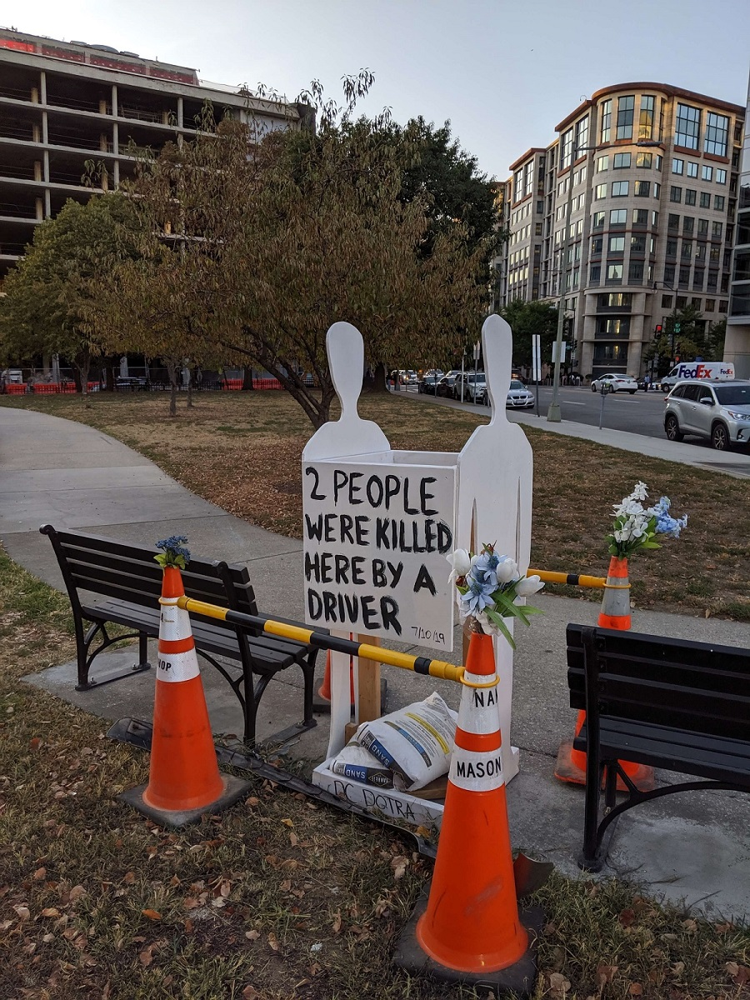

# Of Capital Concern
## Vision Zero and Bike Crashes in Washington, DC

Unless you happen to be cripplingly agoraphobic or tragically ill, mostly everybody comes into contact with their region's transportation network at least twice per day, if not more. And unless you live in an area with a high quality mass public rail transportation system -- places that are regrettably scarce in the US -- you are most likely going to do a good deal of commuting on roads. 

Roads are usually public spaces that drivers, cyclists, and pedestrians share in an often frustratingly fraught disharmony every hour of every day. This discord is tolerated by the billions of people who use roads everyday because roads are indispensable to transporting large numbers of people efficiently and effectively. Since time immemorial roads have been the life-blood of any society and the infrastructure upon which most modern economies are built.

So since time immemorial we have accepted that with roads come accidents. Accidents that [claim 1.35 million lives globally and are the leading cause of death for children and young adults aged 5 to 29](https://www.who.int/news-room/fact-sheets/detail/road-traffic-injuries) are risks every user of a roads assumes during usage. Accidents are often conceived of as unavoidable tragedies without context or causation. Humans are naturally fallible so the deaths and injuries that occur from using roads, while devastating, are not only unintentional but also unavoidable.

In 1997, [the Swedish Parliament passed legislation](https://www.citylab.com/transportation/2014/11/the-swedish-approach-to-road-safety-the-accident-is-not-the-major-problem/382995/) that sought to change this age-old paradigm. Twenty-two years later those regulations sparked a multinational movement that is striving to completely eliminate traffic fatalities and severe injuries while while increasing safe, healthy, equitable mobility for all: [Vision Zero](https://visionzeronetwork.org/about/vision-zero-network/). 

At its core, Vision Zero is born out of the ethical tenet that [everyone has the right to move safely in their communities, and that system designers and policy makers **share** the responsibility to ensure safe systems for travel](https://visionzeronetwork.org/about/what-is-vision-zero/). From there, Vision Zero asserts that system designers required to uphold an ethic of prioritizing the safety of all road users in road design; [they are also responsible for responding to design flaws that result in road injuries and fatalities](https://www.monash.edu/muarc/archive/our-publications/papers/visionzero).

One of the main avenues Vision Zero looks to follow to achieve safe streets is through bringing together diverse and necessary stakeholders such as local traffic planners and engineers, policymakers, and public health professionals to [cross-collaborate on intuitive solutions](https://visionzeronetwork.org/about/what-is-vision-zero/). Of course, one of the most valuable tools these professionals have to work with in the quest to achieve Vision Zero is to analyze the trove of traffic, accident, and city planning data that is collected by governments, private organizations, and universities. 

Of the dozens of cities/regions in the handful of countries that have adopted some kind of Vision Zero ethical stance and policy goals, Washington DC happens to have not only very good data on [traffic accidents](https://visionzeronetwork.org/about/what-is-vision-zero/) but also [Vision Zero Requests](https://opendata.dc.gov/datasets/vision-zero-safety) that anyone can [submit to the DC government](https://www.dcvisionzero.com/take-action) about unsafe road design or behavior in the city.

DC has been one of the more ambitious adopters of Vision Zero with a goal of [eliminating all traffic fatalities and major injuries by 2024](https://www.dcvisionzero.com/action-plan). This emphasis on Vision Zero is important both because the city has intersections that look as [mind-boggling as this](https://dcist.com/story/19/08/22/heres-what-this-map-of-d-c-intersections-says-about-our-streets/) but also because it has such a [large number of bike commuters](https://www.move.org/cities-most-bicycle-commuters/). 

To that end, it would be encouraging to see bike crashes decreasing to help achieve the cities' Vision Zero goal in 5 years. Sadly, the data shows that bike crashes have been on the rise in DC -- though it may look like 2019 might come in a bit under 2018. With the summer months unsurprisingly being some of the most dangerous.

Pure numbers don't tell the whole story with this data though. Luckily, the crash and Vision Zero data from the [DC Open Data Portal](https://opendata.dc.gov/) is geo-coded. One can see, for example, which locations bike users who submitted Vision Zero requests to DC 311 found the most troubling.

Without surprise, the most densely cited areas are downtown such as the M St. and I St. corridors, along with a few other clusters in Columbia Heights, NoMa, and the Southwest Waterfront. However, presenting the data in this way misses some of the more problematic intersections away from the city center. A heat-map of the recent DC bike crashes provides some clarity:

Obviously, the bulk of the crashes are still clustered in many of the same areas of downtown that the Vision Zero requests that bikers have been submitting requests have been in. That said, this map illuminates there are still a handful of intersections away from downtown that have been perilous for bikers including Wisconsin Ave. & Calvert St and MacArthur Blvd. and Reservoir Rd in Northwest DC. Michigan Ave. & Monroe St. and Benning Rd. and Minnesota Ave. in Northeast. And Benning Rd. and G St., Pennsylvania Ave. and Minnesota Ave.,  Minnesota Ave. & Good Hope Rd., and Alabama Ave. & Wheeler Rd. in Southeast Washington.

Of course, intersections alone are not the only level of analysis when looking at the frequency of bike crash data. A single bad intersection or two might be an outlier for what overall is a fairly save neighborhood. Looking at the crashes broken out by Ward really brings home the fact that bikers in Ward 2 are more at risk for getting into an accident more than any other Ward in the District.

It is rather disheartening to see the number of bike crashes rising in Washington despite the city's embrace of the Vision Zero goal. Being able to commute either by Metro or by bike is one of the more attractive perks to living in DC so it will be paramount for the city moving forward to double-down on its Vision Zero commitment and collaborate with city planners, police, and transportation and public health officials to help make its streets safe for all commuters. 

###### A memorial for Thomas Dwight Spriggs and Jesus Antonio Llanes-Datil [who were killed by an SVU driver](https://dc.curbed.com/2019/7/11/20690159/crash-pennsylvania-avenue-traffic-safety-vision-zero) who veered into James Monroe Park at Pennsylvania Ave. & I St. NW on July 10th, 2019.

###### A ghost bike memorial for Jeffery Long who was [killed by a truck driver](https://www.washingtonpost.com/local/public-safety/dc-bicyclist-dies-after-being-struck-by-truck/2018/07/09/8c175692-83b0-11e8-8553-a3ce89036c78_story.html) at the corner of New Hampshire and M St. NW on July 7th, 2018

A huge shoutout to Laura Ellis for the [inspiration](https://www.littlemissdata.com/blog/maps) behind the graphics of this post. Check out her [blog](https://www.littlemissdata.com/blog/) or on Twitter [@LittleMissData](https://twitter.com/LittleMissData) for great Data Science tips in R!